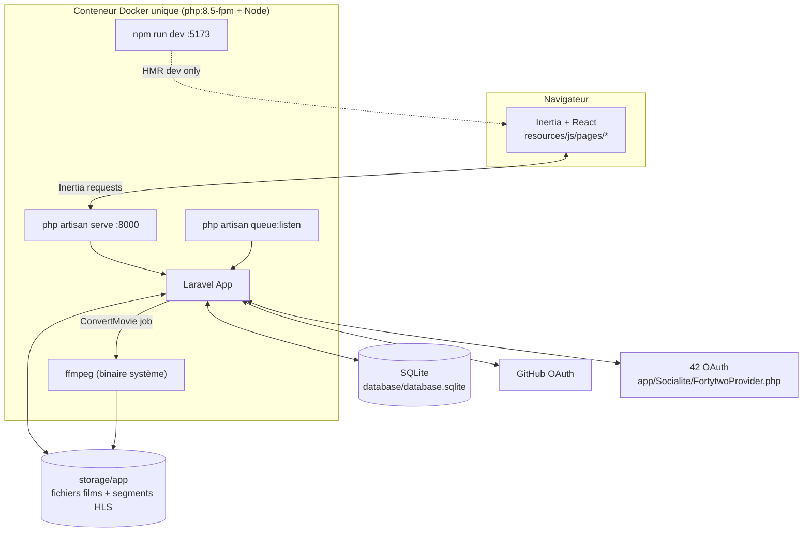
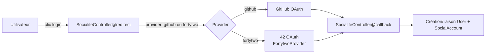
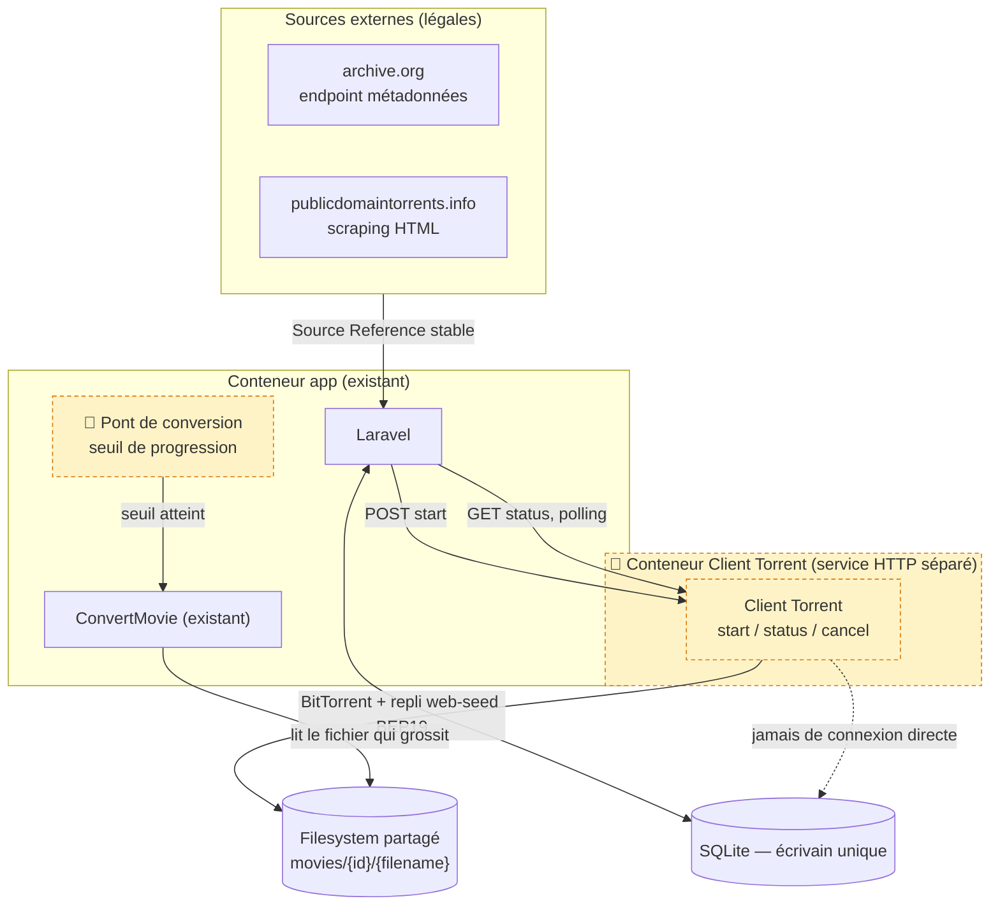

# Architecture Hypertube

État réel du code sur `main` au 17/09/2026 (commit `b59d41b`). Les parties marquées **🚧 cible (non implémentée)** correspondent aux décisions prises dans les issues [#6](https://github.com/FXC-ai/hypertube/issues/6)–[#18](https://github.com/FXC-ai/hypertube/issues/18) mais pas encore codées.

## Vue d'ensemble

Un seul conteneur fait tourner PHP (serveur intégré, pas de nginx/php-fpm actif malgré la présence de `docker/nginx/conf.d/default.conf` — ce fichier n'est référencé par aucun service dans `docker-compose.yml` actuellement), le worker de queue et Vite en parallèle via `composer dev` (`concurrently`). SQLite et le stockage des films sont sur des volumes Docker nommés (`laravel-storage`, `laravel-bootstrap`).

## Pipeline de conversion vidéo (existant)

```mermaid
sequenceDiagram
    participant U as Utilisateur
    participant MC as MovieController
    participant MCC as MovieConversionController
    participant Q as Queue (ConvertMovie)
    participant MP as MediaProbe
    participant TS as TrackSelector
    participant HC as HlsConverter
    participant HR as HlsReadinessChecker
    participant HM as HlsMasterPlaylistBuilder
    participant FS as Storage (fichier + segments HLS)

    U->>MC: GET /movies/{movie}
    MC-->>U: page Inertia (état de conversion)
    U->>MCC: POST /movies/{movie}/conversion
    MCC->>Q: ConvertMovie::dispatch(movieId)
    Q->>MP: probe(inputPath)
    MP-->>Q: MediaInfo (flux vidéo/audio/sous-titres)
    Q->>TS: select(MediaInfo)
    TS-->>Q: SelectedTracks
    Q->>HC: convert(commande ffmpeg, callback)
    loop pendant la conversion
        HC->>FS: écrit segments .ts / .vtt
        HC->>HR: isReady(dossier, tracks)?
        HR-->>HC: oui/non
        HC->>HM: publish(dossier, tracks) si prêt
        HM->>FS: écrit index.m3u8 (master playlist)
    end
    U->>MC: GET /movies/{movie}/hls/{attempt}/index.m3u8
    MC-->>U: playlist HLS (streaming pendant que la conversion continue)
```

Le point clé déjà en place : `HlsReadinessChecker` + `HlsMasterPlaylistBuilder` permettent de publier une playlist HLS lisible **avant** la fin complète de la conversion — la lecture progressive fonctionne. Ce que `ConvertMovie` suppose encore : le fichier source (`movies/{id}/{filename}`) est **déjà entièrement présent** sur disque au moment du dispatch ; rien ne le nourrit pendant un téléchargement en cours.

## Authentification

Deux stratégies Omniauth (exigence sujet §III.1) : GitHub et 42, toutes deux passant par `SocialiteController`. Le provider 42 est un adaptateur maison (`App\Socialite\FortytwoProvider`, étend `Laravel\Socialite\Two\AbstractProvider`) enregistré dans `AppServiceProvider::boot()`.

## 🚧 Cible : Client Torrent + Pont de conversion

Décisions actées (voir [ADR-0005](adr/0005-oauth2-passport-for-rest-api.md) et les issues [#6](https://github.com/FXC-ai/hypertube/issues/6)–[#18](https://github.com/FXC-ai/hypertube/issues/18)) :

- Le Client Torrent est un service HTTP **séparé**, dans son propre conteneur, qui n'écrit jamais directement en base — seul Laravel lit/écrit en SQLite.
- Corrélation `Movie` ↔ `Source` via une **Source Reference** stable (ex. l'`identifier` archive.org), jamais un info-hash ou magnet link — ceux-ci changent quand une source régénère son torrent.
- `archive.org` ne seed pas lui-même en pair-à-pair : le repli web-seeding (BEP19) est le chemin principal pour cette source, pas un simple filet de sécurité.
- Le pont de conversion déclenche `ConvertMovie` sur un seuil de progression (interrogé via l'API `status` du Client Torrent), `ffmpeg` lisant directement le fichier partagé pendant qu'il grossit — risque connu et non résolu : `moov atom`/`Cues` parfois en fin de fichier, à valider tôt.

## Modules principaux (état actuel)

| Zone | Fichiers clés |
|---|---|
| Modèle Movie | `app/Models/Movie.php`, `app/Enums/ConversionStatus.php` |
| Conversion HLS | `app/Jobs/ConvertMovie.php`, `app/Services/Media/{MediaProbe,TrackSelector,HlsCommandBuilder,HlsConverter,HlsReadinessChecker,HlsMasterPlaylistBuilder}.php` |
| Objets de données média | `app/Data/{MediaInfo,MediaStream,SelectedTracks}.php` |
| Contrôleurs film | `app/Http/Controllers/{MovieController,MovieConversionController}.php` |
| Auth sociale | `app/Http/Controllers/Auth/SocialiteController.php`, `app/Socialite/FortytwoProvider.php` |
| Frontend film | `resources/js/pages/movies/show.tsx` |
| Docker | `Dockerfile`, `docker-compose.yml`, `docker/entrypoint.sh` |

## Ce qui n'existe pas encore

- Client Torrent (aucun code — protocole BitTorrent, BEP19, API HTTP)
- Recherche/scraping des sources externes (archive.org, publicdomaintorrents.info)
- Commentaires (modèle, endpoints — [issue #3](https://github.com/FXC-ai/hypertube/issues/3))
- API REST OAuth2 (Passport — [issue #5](https://github.com/FXC-ai/hypertube/issues/5))
- Nettoyage automatique des films non visionnés depuis un mois
