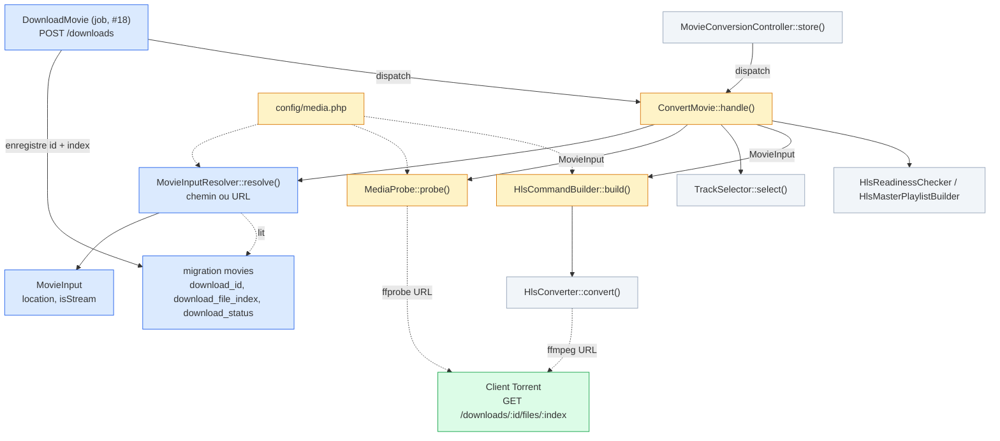
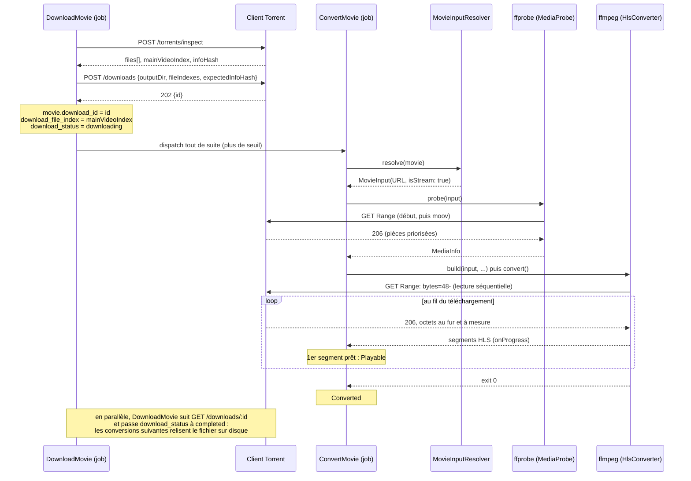

# Streaming HTTP : ce qui change côté Laravel (ticket B)

**Statut : proposé, à valider par FX.** Complète l'[ADR-0007](adr/0007-stream-partial-files-over-http.md) (le *pourquoi*) avec le *comment* : quelles classes et fonctions du pipeline de conversion changent, avec du code prototype, les résultats d'un prototype exécuté avec les vraies commandes ffmpeg du projet, et les avantages et inconvénients de l'approche. Le contrat de l'endpoint est dans [torrent-client/API.md](../torrent-client/API.md#get-downloadsidfilesindex--proposé-ticket-b).

## En une phrase

Tant qu'un film se télécharge, `ConvertMovie` passe à ffprobe et ffmpeg une **URL** `http://client-torrent:7881/downloads/{id}/files/{index}` au lieu du chemin du fichier, avec quatre options en plus. Le reste du pipeline (`TrackSelector`, `HlsReadinessChecker`, `HlsMasterPlaylistBuilder`, `HlsConverter`, les statuts) ne change pas.

## 1. Résultats du prototype

Pour lever les inconnues avant d'écrire une ligne dans Laravel, [`torrent-client/prototypes/range-stream-prototype.mjs`](../torrent-client/prototypes/range-stream-prototype.mjs) imite l'endpoint : il simule un torrent multi-fichiers (fichiers mis bout à bout, découpés en pièces de 1 Mo), fait "arriver" les pièces à débit limité, sert les requêtes `Range` et fait attendre celles qui tombent sur des pièces manquantes. On a lancé dessus **la commande exacte générée par `HlsCommandBuilder::build()`**, sur une vidéo de test de 60 s (15,5 Mo, 2 pièces/s, soit environ 8 s de "téléchargement").

| Scénario | Résultat |
|---|---|
| MP4 avec `moov` **en fin de fichier** (le cas à risque de #14) | ffprobe répond en **0,8 s** alors que 2 pièces sur 15 sont arrivées. HLS complet (60 s) produit **pendant** le téléchargement, en 8 s. |
| MKV avec `Cues` en fin de fichier | ffprobe fait **une seule** requête : ce dont il a besoin (`Tracks`, codecs) est au début. Les `Cues` ne servent qu'à se déplacer dans le film. HLS complet. |
| MKV dont le début est dans une pièce **partagée** avec `meta.sqlite` | Format reconnu (`matroska,webm`), HLS complet. L'endpoint ne sert que les octets du film, la part du sqlite n'est jamais envoyée. |
| MP4 dont le `moov` est **à cheval sur 2 pièces**, la 2e partagée avec `subs.srt` | Le client priorise les **deux** pièces, ffprobe a sa réponse en 483 ms. Format reconnu (`mov,mp4`), HLS complet. |
| Pièce qui arrive très en retard (12 s, le client abandonne la requête à 5 s) | Avec `-reconnect` : ffmpeg **redemande exactement à l'octet coupé** (`Range: bytes=7340032-`), attend, et produit les 60 s. |
| ⚠️ Pièce qui n'arrive **jamais**, commande actuelle | ffmpeg affiche `Stream ends prematurely` mais **sort avec le code 0** : un film de **28 s sur 60** serait marqué `Converted`. |
| Pièce qui n'arrive jamais, avec `-xerror` | ffmpeg sort en erreur (code 183) : `HlsConverter` lève `MediaConversionException`, le film passe en `Failed`. |

Ce que ffprobe demande réellement sur un MP4 avec `moov` en fin de fichier :

```
Range: bytes=0-          → lit ftyp et l'en-tête de mdat, y trouve la taille de mdat
Range: bytes=15519826-   → saute directement au moov (offset = fin de mdat), le client le priorise
Range: bytes=48-         → revient au début des données vidéo
```

Le client n'a **rien eu à analyser** : ffprobe calcule lui-même où est le `moov` et le demande ; il suffit que le client priorise les pièces demandées.

Les deux points qui changent la conception :

1. **`-xerror` est obligatoire.** Sans lui, une coupure du flux donne une conversion tronquée marquée réussie. C'est d'ailleurs aussi vrai aujourd'hui avec un fichier local corrompu : l'option a du sens dans tous les cas.
2. **`-reconnect` seulement sur les erreurs réseau, pas sur les erreurs HTTP.** Avec `-reconnect_on_http_error 5xx`, une pièce morte a fait boucler ffmpeg **5 min** sur des `503`, alors que le client avait déjà abandonné. Sans cette option, un `503` arrête ffmpeg tout de suite.

## 2. Ce qui change, classe par classe



Légende : bleu = nouveau, orange = modifié, gris = inchangé, vert = Client Torrent.

| Fichier | Fonction | Changement |
|---|---|---|
| `config/media.php` | - | Ajout de `torrent_client_url` et des réglages du flux (`stream.*`). |
| `app/Services/Media/MovieInput.php` | - | **Nouveau.** Où lire le film : un chemin ou une URL. |
| `app/Services/Media/MovieInputResolver.php` | `resolve(Movie): MovieInput` | **Nouveau.** URL du client tant que le téléchargement est en cours, chemin disque sinon. |
| `app/Services/Media/MediaProbe.php` | `probe(string $inputPath)` → `probe(MovieInput $input)` | Ne vérifie `is_file()` que pour un fichier ; ajoute les options de flux avant l'entrée ; timeout plus long pour une URL. |
| `app/Services/Media/HlsCommandBuilder.php` | `build(string $inputPath, ...)` → `build(MovieInput $input, ...)` | Ajoute `-xerror` (toujours) et les options de flux avant `-i` (pour une URL). |
| `app/Jobs/ConvertMovie.php` | `handle()` | Obtient l'entrée via `MovieInputResolver` au lieu de construire le chemin ; la passe à `probe()` et `build()`. |
| `app/Models/Movie.php` + migration | - | Champs `download_id`, `download_file_index`, `download_status` (prévus par #6 de toute façon). |
| `HlsConverter`, `TrackSelector`, `HlsReadinessChecker`, `HlsMasterPlaylistBuilder`, `MovieConversionController` | - | **Aucun changement.** |

## 3. Le déroulé



Si quelque chose casse en route (pièce morte, client redémarré, swarm vide), ffmpeg sort en erreur grâce à `-xerror`, `ConvertMovie` passe en `Failed` comme aujourd'hui, et le reenqueue de #18 relance un téléchargement qui **reprend** grâce à la revérification sur disque (ticket C, [ADR-0008](adr/0008-client-state-in-memory-with-disk-recheck.md)).

## 4. Code prototype

Ce code n'a **pas** été exécuté dans Laravel : c'est une proposition qui suit les conventions du projet (classes `final`, `readonly` pour les données). Les commandes ffmpeg/ffprobe qu'il produit, elles, ont été testées avec le prototype ci-dessus.

### `config/media.php`

```php
return [
    'ffmpeg_binary' => env('FFMPEG_BINARY', 'ffmpeg'),
    'ffprobe_binary' => env('FFPROBE_BINARY', 'ffprobe'),
    'torrent_client_url' => env('TORRENT_CLIENT_URL', 'http://client-torrent:7881'),
    'stream' => [
        // Au-dessus du STREAM_STALL_TIMEOUT_MS du client (60 s), sinon ffmpeg abandonne
        // pendant que le client attend encore une pièce. En microsecondes.
        'rw_timeout_us' => 90_000_000,
        // ffprobe peut devoir attendre les pièces du moov : 60 s ne suffit pas toujours.
        'probe_timeout_s' => 300,
    ],
    'hls' => [
        'segment_duration' => 6,
        'bandwidth' => 1_700_000,
    ],
];
```

### `app/Services/Media/MovieInput.php` (nouveau)

```php
namespace App\Services\Media;

final readonly class MovieInput
{
    public function __construct(
        public string $location,
        public bool $isStream,
    ) {}

    /**
     * Options à placer AVANT l'entrée (-i pour ffmpeg, avant le chemin pour ffprobe).
     *
     * @return list<string>
     */
    public function inputOptions(): array
    {
        if (! $this->isStream) {
            return [];
        }

        return [
            '-rw_timeout', (string) config('media.stream.rw_timeout_us'),
            // Reprend à l'octet coupé si la connexion tombe. Volontairement PAS
            // -reconnect_on_http_error : un 503 veut dire que le client a abandonné.
            '-reconnect', '1',
            '-reconnect_on_network_error', '1',
            '-reconnect_delay_max', '30',
        ];
    }
}
```

### `app/Services/Media/MovieInputResolver.php` (nouveau)

```php
namespace App\Services\Media;

use App\Enums\DownloadStatus; // à créer, sur le modèle de ConversionStatus
use App\Models\Movie;
use Illuminate\Support\Facades\Storage;

final class MovieInputResolver
{
    public function resolve(Movie $movie): MovieInput
    {
        if ($movie->download_status === DownloadStatus::Downloading && $movie->download_id !== null) {
            $base = rtrim((string) config('media.torrent_client_url'), '/');

            return new MovieInput(
                "{$base}/downloads/{$movie->download_id}/files/{$movie->download_file_index}",
                isStream: true,
            );
        }

        return new MovieInput(
            Storage::disk('public')->path("movies/{$movie->id}/{$movie->filename}"),
            isStream: false,
        );
    }
}
```

### `MediaProbe::probe()` (modifié)

```diff
-    public function probe(string $inputPath): MediaInfo
+    public function probe(MovieInput $input): MediaInfo
     {
-        if (! is_file($inputPath)) {
+        if (! $input->isStream && ! is_file($input->location)) {
             throw new MediaConversionException('Source file not found.');
         }

         $process = new Process([
             (string) config('media.ffprobe_binary'),
             '-v',
             'error',
+            ...$input->inputOptions(),
             '-show_streams',
             '-of',
             'json',
-            $inputPath,
+            $input->location,
         ]);
-        $process->setTimeout(60);
+        $process->setTimeout($input->isStream ? (int) config('media.stream.probe_timeout_s') : 60);
```

### `HlsCommandBuilder::build()` (modifié)

```diff
-    public function build(string $inputPath, string $outputDirectory, SelectedTracks $tracks): array
+    public function build(MovieInput $input, string $outputDirectory, SelectedTracks $tracks): array
     {
         ...
         $arguments = [
             (string) config('media.ffmpeg_binary'),
             '-hide_banner',
             '-y',
+            // Sans -xerror, un flux coupé donne un HLS tronqué avec un code de sortie 0.
+            '-xerror',
             '-progress',
             'pipe:1',
             '-nostats',
+            ...$input->inputOptions(),
             '-i',
-            $inputPath,
+            $input->location,
```

### `ConvertMovie::handle()` (modifié)

```diff
     public function handle(
         MediaProbe $probe,
         TrackSelector $trackSelector,
         HlsCommandBuilder $commands,
         HlsReadinessChecker $hlsReadinessChecker,
         HlsMasterPlaylistBuilder $hlsMasterPlaylistBuilder,
-        HlsConverter $hlsConverter
+        HlsConverter $hlsConverter,
+        MovieInputResolver $inputs,
     ): void {
         ...
-            $inputPath = Storage::disk('public')->path("movies/{$movie->id}/{$movie->filename}");
+            $input = $inputs->resolve($movie);
             $outputDirectory = Storage::disk('public')->path("movies/{$movie->id}/hls/{$attempt}");
             ...
-            $tracksSelected = $trackSelector->select($probe->probe($inputPath));
+            $tracksSelected = $trackSelector->select($probe->probe($input));
             ...
             $hlsConverter->convert(
-                $commands->build($inputPath, $outputDirectory, $tracksSelected),
+                $commands->build($input, $outputDirectory, $tracksSelected),
                 $publishWhenReady,
             );
```

### Migration (esquisse)

```php
Schema::table('movies', function (Blueprint $table) {
    $table->uuid('download_id')->nullable();
    $table->unsignedInteger('download_file_index')->nullable();
    $table->string('download_status')->default('pending'); // pending, downloading, completed, failed
});
```

Ces champs sont ceux que #6 prévoyait déjà ("ajouter les champs d'état de téléchargement, distincts des champs `conversion_*`"). Qui les remplit (`DownloadMovie`, retry, `Exhausted`) relève de #18, pas de ce ticket.

## 5. Avantages et inconvénients

### Avantages

| | Pourquoi |
|---|---|
| **ffmpeg ne lit jamais un trou** | L'endpoint ne renvoie que des octets vérifiés par hash ; un octet absent fait attendre au lieu de renvoyer des zéros. C'est le problème que la lecture directe du fichier ne peut pas résoudre. |
| **Pas de seuil à régler** | `ConvertMovie` peut partir dès le `202` de `POST /downloads`. Le seuil de #14 (combien de % attendre ?) disparaît, avec ses cas limites (trou au début à 86 %, `moov` à la fin). |
| **Pas de parsing MP4/MKV à écrire** | Ni côté Laravel, ni côté client : ffprobe sait où chercher le `moov` ou les `Tracks`, le client priorise ce qu'il demande. Vérifié sur MP4 `moov`-en-fin et MKV `Cues`-en-fin. |
| **Démarrage rapide** | ffprobe a répondu avec 2 pièces sur 15 ; le premier segment HLS peut sortir dès que le début du film est là, quel que soit l'ordre d'arrivée du reste. |
| **Peu de code côté Laravel** | Une petite classe de données, un résolveur, deux signatures qui passent de `string` à `MovieInput`, et des options ffmpeg. Le reste du pipeline est intact. |
| **Robuste aux lenteurs** | Avec `-reconnect`, une coupure reprend exactement où elle s'était arrêtée (vérifié). |
| **Échecs visibles** | Avec `-xerror`, un flux mort donne `Failed` au lieu d'un film tronqué marqué `Converted`. Améliore aussi le cas d'un fichier local corrompu. |
| **Indépendant de la position des fichiers dans le torrent** | Un film dont le début ou la fin partage une pièce avec un autre fichier se lit pareil (vérifié). |

### Inconvénients et risques

| | Pourquoi | Parade |
|---|---|---|
| **Un worker de queue occupé pendant tout le téléchargement** | `ConvertMovie` dure maintenant aussi longtemps que le téléchargement (ffmpeg avance au rythme des pièces). Avec un seul `queue:work` dans le conteneur `worker`, les autres jobs attendent, y compris les `DownloadMovie` d'autres films. | Une queue dédiée aux conversions (`ConvertMovie::dispatch(...)->onQueue('conversions')`) avec son propre processus ou plusieurs répliques du conteneur `worker`. À décider avec #18. |
| **Dépend de la disponibilité du Client Torrent** | Si le conteneur redémarre pendant une conversion, l'URL répond `404` et la conversion échoue. | `-xerror` rend l'échec propre, #18 relance, et la revérification (ticket C) reprend le téléchargement sans tout refaire. |
| **Deux chemins de lecture** | URL pendant le téléchargement, fichier après. Un bug peut se cacher dans l'un des deux. | Les deux passent par la même `MovieInput` ; les tests de `MediaProbe` et `HlsCommandBuilder` couvrent les deux cas. |
| **La conversion ne va pas plus vite que le téléchargement** | ffmpeg lit dans l'ordre : il attend chaque pièce. | Inhérent au streaming pendant téléchargement ; c'était déjà le cas avec la lecture directe. |
| **Se déplacer loin dans le film reste impossible avant conversion** | Le spectateur lit le HLS, qui n'existe que jusqu'où ffmpeg est arrivé. ffmpeg ne priorise pas ce que regarde le spectateur. | Inchangé par rapport à aujourd'hui. Hors périmètre. |
| **Réglages à garder cohérents** | `rw_timeout_us` doit rester au-dessus du `STREAM_STALL_TIMEOUT_MS` du client, et le timeout de ffprobe assez long pour attendre le `moov`. | Valeurs par défaut documentées des deux côtés (ici et dans `API.md`). |
| **Nouveau code à écrire côté client** | L'endpoint, la priorité des pièces et l'attente sont à implémenter (ticket B). | Le prototype fixe le comportement attendu et sert de référence pour les tests. |

### Comparaison avec la lecture directe du fichier (#6 / #14)

| Critère | Lecture directe + seuil | Streaming HTTP |
|---|---|---|
| Trou dans le fichier | Lu comme des zéros, sans erreur | Impossible : la requête attend |
| `moov` en fin de MP4 | Il faut le télécharger avant de lancer, donc le trouver | ffprobe le demande, le client le priorise |
| Quand lancer `ConvertMovie` | Après un seuil à choisir | Dès le `202` |
| Code de parsing de conteneur | Nécessaire (MP4 et MKV) | Aucun |
| Worker occupé | Durée de la conversion | Durée du téléchargement (voir parade) |
| Dépendance au client pendant la conversion | Aucune | Oui (échec propre + reprise) |
| Changements Laravel | Polling du seuil | `MovieInput`, résolveur, options ffmpeg |

## 6. Points ouverts

1. **Validation de l'[ADR-0007](adr/0007-stream-partial-files-over-http.md)** par FX, avant de créer le ticket B.
2. **Queue dédiée aux conversions** : nécessaire dès qu'on convertit pendant le téléchargement (voir inconvénients).
3. **Fichier vidéo dans un sous-dossier du torrent** : `ConvertMovie` refuse aujourd'hui un `filename` qui contient `/` (`Invalid file name.`). Dans un torrent multi-fichiers, la vidéo peut être dans un sous-dossier (`files[].path` = `Sample/movie.mp4`). Avec l'URL, le nom n'est plus utilisé pendant le téléchargement, mais il le reste pour le chemin disque après. Il faudra soit accepter un chemin relatif contrôlé, soit stocker le chemin relatif à part.
4. **`-xerror` dès maintenant ?** Indépendamment du streaming, il évite qu'une conversion tronquée soit marquée `Converted`. Peut entrer dans le code de FX sans attendre le ticket B.

## 7. Rejouer le prototype

Prérequis : Node ≥ 20 et ffmpeg/ffprobe.

```bash
cd torrent-client/prototypes
# une vidéo de test de 60 s avec moov en fin de fichier (comportement par défaut de ffmpeg)
ffmpeg -v error -y -f lavfi -i testsrc2=size=1280x720:rate=25 -f lavfi -i sine=frequency=440 -t 60 -c:v libx264 -preset veryfast -b:v 2M -c:a aac moov-end.mp4
# torrent simulé : 188 814 octets avant le film (moov à cheval sur 2 pièces), un .srt après
node range-stream-prototype.mjs "before.bin:188814,moov-end.mp4,subs.srt:700000" 1 2 8790
```

Dans un autre terminal :

```bash
ffprobe -v error -rw_timeout 90000000 -show_streams http://127.0.0.1:8790/movie.mp4
```

Le serveur affiche chaque requête, les pièces du torrent qu'elle touche (et avec quels autres fichiers elles sont partagées), combien manquaient et combien de temps la réponse a attendu. Pour simuler une pièce lente ou morte : 5e argument = numéro de pièce, avec `LATE_MS=12000` (arrive au bout de 12 s) ou sans (n'arrive jamais), et `STALL_TIMEOUT_MS=5000` pour raccourcir l'attente côté client.
