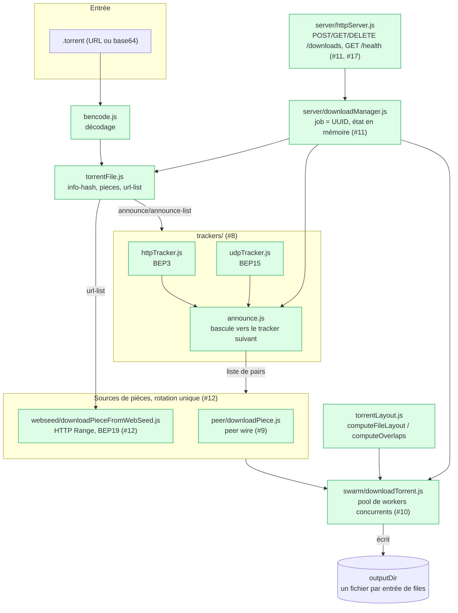
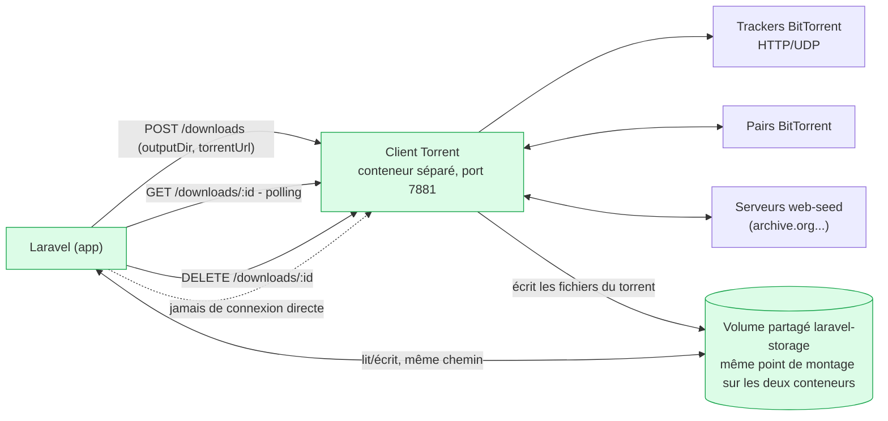
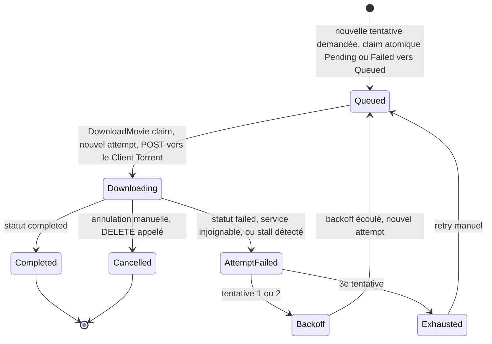

# Vue d'ensemble - Client Torrent

Ce document donne la vue architecture du Client Torrent : ce qui est construit (#7–#12, #17) et
la conception retenue pour la suite (#18, pas encore implémentée). Pour les autres angles :

- [README.md](README.md) - guide de test, module par module, avec les pièges réels rencontrés
- [API.md](API.md) - contrat HTTP (`start`/`status`/`cancel`) pour l'appelant Laravel
- [docs/architecture.md](../docs/architecture.md) - vue d'ensemble de tout Hypertube, pas
  seulement le Client Torrent
- [CONTEXT.md](../CONTEXT.md) - glossaire des termes utilisés ici (piece retry, download
  attempt, reenqueue, exhausted...)
- [ADR-0006](../docs/adr/0006-download-retry-diverges-from-conversion-retry.md) - pourquoi le
  retry de téléchargement ne copie pas celui de la conversion

## Architecture interne (ce qui est construit)

Chaque flèche correspond à une dépendance **injectable** (`fetchImpl`, `parseTorrentFileFn`,
`announceFn`, `downloadTorrentFn`...) - voir [README.md](README.md) pour le détail par module et
les real-network integration tests qui prouvent chaque brique contre de vraies infrastructures
(archive.org, Sintel/webtorrent.io, tracker.opentrackr.org).

## Où ça se branche sur Hypertube (#17, en place aujourd'hui)

Le Client Torrent n'écrit jamais en base de données et ne connaît aucune notion de film,
d'utilisateur ou de tentative - voir [CONTEXT.md](../CONTEXT.md#language). Toute logique
propre à Hypertube (corrélation film ↔ source, retry, affichage) vit côté Laravel.

## Conception retry & reenqueue (issue #18)

**Statut : conception uniquement, rien n'est implémenté.** Ce qui suit vise à faire passer #18
de `needs-triage` à `ready-for-dev`, pas à documenter du code existant. Vocabulaire complet dans
[CONTEXT.md](../CONTEXT.md#language) - résumé rapide :

- **Piece retry** (déjà construit, interne au Client Torrent) : une pièce qui échoue est
  retentée contre une autre source, jusqu'à `maxAttemptsPerPiece`. Ne concerne pas ce qui suit.
- **Download attempt** : une tentative complète de téléchargement, namespacée par un UUID côté
  Laravel - même mécanique que `conversion_attempt`.
- **Reenqueue** : le redémarrage automatique d'un download attempt après échec, borné et avec
  backoff - **diverge volontairement** du retry (manuel, non borné) de la conversion, voir
  [ADR-0006](../docs/adr/0006-download-retry-diverges-from-conversion-retry.md).
- **Exhausted** : l'état après 3 échecs consécutifs - plus de reenqueue automatique, seule une
  action manuelle peut relancer.

### Où vit la logique

Entièrement côté **Laravel** : un nouveau Job (`DownloadMovie` ou équivalent), qui appelle
l'API stateless du Client Torrent exactement comme documentée dans [API.md](API.md) - aucun
changement requis côté Client Torrent lui-même. Ce choix suit le même principe que pour la
conversion (`ConvertMovie`), où toute la logique métier vit dans le Job, pas dans un service
externe.

### Machine à états d'un download attempt

Le détail complet de chaque transition (endpoints exacts, timings, critères) est dans le tableau
juste en dessous - le diagramme reste volontairement lisible plutôt qu'exhaustif.

**Annulation manuelle pendant un attempt** : si `DELETE /downloads/:id` est appelé pendant un
`Downloading`, ça ne compte **pas** comme un échec - c'est une intention explicite de
l'utilisateur, pas un accident transitoire, donc aucun reenqueue automatique ne doit s'ensuivre.
Sortie propre du cycle de retry (`Cancelled`), pas un décompte de tentative. Ça s'aligne avec le
Client Torrent lui-même, dont le `GET /downloads/:id` rapporte déjà `"cancelled"` séparément de
`"failed"` (voir [API.md](API.md)) - la machine à états Laravel respecte cette même distinction au
lieu de l'aplatir. Point ouvert, pas encore tranché : un film `Cancelled` peut-il être relancé
manuellement comme un `Exhausted` (`Cancelled --> Queued`), ou est-ce une fin définitive tant que
l'utilisateur ne relance pas l'intégralité du flux depuis le début ?

### Décisions actées

| Sujet | Décision |
|---|---|
| Déclencheur | Automatique pour les 3 premières tentatives (Job Laravel, `$tries`/backoff), manuel ensuite |
| Nombre de tentatives | 3 tentatives automatiques avant `Exhausted` |
| Backoff | Délai croissant entre tentatives (ex. 1 min puis 5 min), pas de reenqueue immédiat |
| Fichiers de l'attempt échoué | `outputDir` namespacé par `download_attempt` (miroir de `hls/{conversion_attempt}`) ; fichiers laissés sur disque, pas de purge automatique - cohérent avec le comportement déjà documenté pour `DELETE /downloads/:id` dans [API.md](API.md) |
| Ce qui compte comme échec | `status: "failed"` explicite **ou** Client Torrent injoignable (le service ne doit pas pouvoir bloquer silencieusement un téléchargement en redémarrant) - une annulation manuelle (`DELETE`) n'en fait **pas** partie, voir ci-dessus |
| Détection de blocage | Pas de progression de `piecesCompleted` pendant 60s malgré `status: "downloading"` - valeur de départ, à ajuster selon retour terrain |
| Polling recommandé | Toutes les 2s tant que `status == "downloading"` (même intervalle que l'exemple curl d'[API.md](API.md)) |

### Hors scope de cette conception

- Aucune modification du Client Torrent lui-même (reste stateless, ignore la notion de tentative)
- Le déclenchement manuel après `Exhausted` (bouton UI, endpoint exact) - dépend de #15 (état
  visible du pipeline), pas encore conçu
- L'affichage temps réel de l'état (#15) - sujet frontend séparé, bloqué par #13/#14 comme #18
- Persistance des jobs du Client Torrent après un redémarrage de conteneur - gap connu, noté
  dans [README.md](README.md#notes-pour-la-suite)
