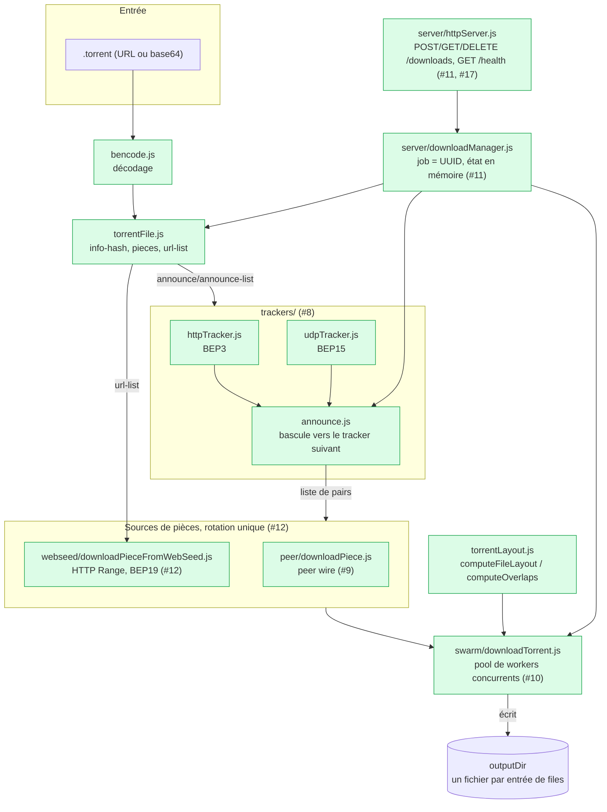
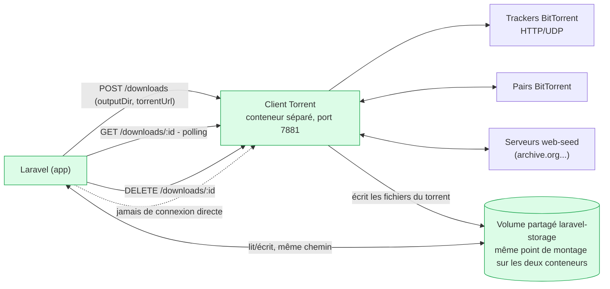
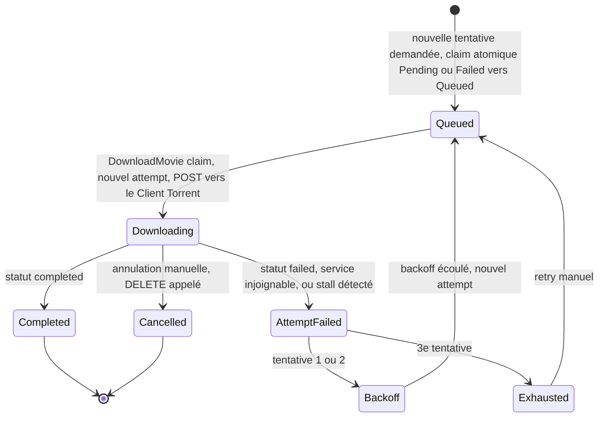
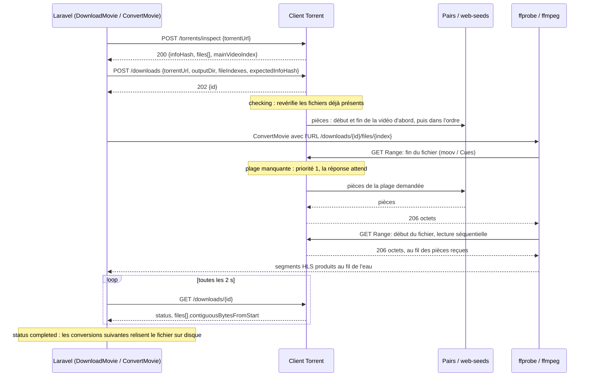

# Vue d'ensemble - Client Torrent

Ce document donne la vue architecture du Client Torrent : ce qui est construit (#7–#12, #17) et la conception retenue pour la suite (#18, pas encore implémentée). Pour les autres angles :

- [README.md](README.md) - guide de test, module par module, avec les pièges réels rencontrés
- [API.md](API.md) - contrat HTTP (`start`/`status`/`cancel`) pour l'appelant Laravel
- [docs/architecture.md](../docs/architecture.md) - vue d'ensemble de tout Hypertube, pas seulement le Client Torrent
- [CONTEXT.md](../CONTEXT.md) - glossaire des termes utilisés ici (piece retry, download attempt, reenqueue, exhausted...)
- [ADR-0006](../docs/adr/0006-download-retry-diverges-from-conversion-retry.md) - pourquoi le retry de téléchargement ne copie pas celui de la conversion
- [ADR-0007](../docs/adr/0007-stream-partial-files-over-http.md) - pourquoi ffmpeg lit un film en cours de téléchargement via HTTP plutôt que le fichier qui grossit (proposé)
- [ADR-0008](../docs/adr/0008-client-state-in-memory-with-disk-recheck.md) - pourquoi l'état reste en mémoire, avec reprise par revérification des fichiers sur disque (proposé)

## Architecture interne (ce qui est construit)


```mermaid
flowchart TB
    subgraph Input["Entrée"]
        TorrentFile[".torrent (URL ou base64)"]
    end

    Bencode["bencode.js\ndécodage"]
    TorrentFileMod["torrentFile.js\ninfo-hash, pieces, url-list"]
    TorrentFile --> Bencode --> TorrentFileMod

    subgraph Trackers["trackers/ (#8)"]
        HttpT["httpTracker.js\nBEP3"]
        UdpT["udpTracker.js\nBEP15"]
        Announce["announce.js\nbascule vers le tracker suivant"]
        HttpT --> Announce
        UdpT --> Announce
    end
    TorrentFileMod -->|announce/announce-list| Trackers
    Announce -->|liste de pairs| Sources

    subgraph Sources["Sources de pièces, rotation unique (#12)"]
        Peer["peer/downloadPiece.js\npeer wire (#9)"]
        WebSeed["webseed/downloadPieceFromWebSeed.js\nHTTP Range, BEP19 (#12)"]
    end
    TorrentFileMod -->|url-list| WebSeed

    Layout["torrentLayout.js\ncomputeFileLayout / computeOverlaps"]
    Swarm["swarm/downloadTorrent.js\npool de workers concurrents (#10)"]
    Sources --> Swarm
    Layout --> Swarm
    Swarm -->|écrit| Disk[("outputDir\nun fichier par entrée de files")]

    Manager["server/downloadManager.js\njob = UUID, état en mémoire (#11)"]
    Manager --> TorrentFileMod
    Manager --> Announce
    Manager --> Swarm

    Http["server/httpServer.js\nPOST/GET/DELETE /downloads, GET /health (#11, #17)"]
    Http --> Manager

    classDef done fill:#dcfce7,stroke:#16a34a;
    class Bencode,TorrentFileMod,HttpT,UdpT,Announce,Peer,WebSeed,Layout,Swarm,Manager,Http done;
```

Chaque flèche correspond à une dépendance **injectable** (`fetchImpl`, `parseTorrentFileFn`, `announceFn`, `downloadTorrentFn`...) - voir [README.md](README.md) pour le détail par module et les real-network integration tests qui prouvent chaque brique contre de vraies infrastructures (archive.org, Sintel/webtorrent.io, tracker.opentrackr.org).

## Où ça se branche sur Hypertube (#17, en place aujourd'hui)


```mermaid
flowchart LR
    Laravel["Laravel (app)"]
    CT["Client Torrent\nconteneur séparé, port 7881"]
    Shared[("Volume partagé laravel-storage\nmême point de montage sur les deux conteneurs")]
    Trackers2["Trackers BitTorrent\nHTTP/UDP"]
    Peers["Pairs BitTorrent"]
    WebSeeds["Serveurs web-seed\n(archive.org...)"]

    Laravel -->|"POST /downloads (outputDir, torrentUrl)"| CT
    Laravel -->|"GET /downloads/:id - polling"| CT
    Laravel -->|"DELETE /downloads/:id"| CT
    CT --> Trackers2
    CT <--> Peers
    CT <--> WebSeeds
    CT -->|écrit les fichiers du torrent| Shared
    Laravel <-->|lit/écrit, même chemin| Shared
    Laravel -.->|jamais de connexion directe| CT

    classDef done fill:#dcfce7,stroke:#16a34a;
    class Laravel,CT,Shared done;
```

Le Client Torrent n'écrit jamais en base de données et ne connaît aucune notion de film, d'utilisateur ou de tentative - voir [CONTEXT.md](../CONTEXT.md#language). Toute logique propre à Hypertube (corrélation film ↔ source, retry, affichage) vit côté Laravel.

## Conception retry & reenqueue (issue #18)

**Statut : conception uniquement, rien n'est implémenté.** Ce qui suit vise à faire passer #18 de `needs-triage` à `ready-for-dev`, pas à documenter du code existant. Vocabulaire complet dans [CONTEXT.md](../CONTEXT.md#language) - résumé rapide :

- **Piece retry** (déjà construit, interne au Client Torrent) : une pièce qui échoue est retentée contre une autre source, avec backoff, tant que le téléchargement progresse (règles de #27, voir plus bas). Ne concerne pas ce qui suit.
- **Download attempt** : une tentative complète de téléchargement, namespacée par un UUID côté Laravel - même mécanique que `conversion_attempt`.
- **Reenqueue** : le redémarrage automatique d'un download attempt après échec, borné et avec backoff - **diverge volontairement** du retry (manuel, non borné) de la conversion, voir [ADR-0006](../docs/adr/0006-download-retry-diverges-from-conversion-retry.md).
- **Exhausted** : l'état après 3 échecs consécutifs - plus de reenqueue automatique, seule une action manuelle peut relancer.

### Où vit la logique

Entièrement côté **Laravel** : un nouveau Job (`DownloadMovie` ou équivalent), qui appelle l'API stateless du Client Torrent exactement comme documentée dans [API.md](API.md) - aucun changement requis côté Client Torrent lui-même. Ce choix suit le même principe que pour la conversion (`ConvertMovie`), où toute la logique métier vit dans le Job, pas dans un service externe.

### Machine à états d'un download attempt


```mermaid
stateDiagram-v2
    [*] --> Queued: nouvelle tentative demandée, claim atomique Pending ou Failed vers Queued
    Queued --> Downloading: DownloadMovie claim, nouvel attempt, POST vers le Client Torrent
    Downloading --> Completed: statut completed
    Downloading --> AttemptFailed: statut failed, service injoignable, ou stall détecté
    Downloading --> Cancelled: annulation manuelle, DELETE appelé
    AttemptFailed --> Backoff: tentative 1 ou 2
    Backoff --> Queued: backoff écoulé, nouvel attempt
    AttemptFailed --> Exhausted: 3e tentative
    Exhausted --> Queued: retry manuel
    Completed --> [*]
    Cancelled --> [*]
```

Le détail complet de chaque transition (endpoints exacts, timings, critères) est dans le tableau juste en dessous - le diagramme reste volontairement lisible plutôt qu'exhaustif.

**Annulation manuelle pendant un attempt** : si `DELETE /downloads/:id` est appelé pendant un `Downloading`, ça ne compte **pas** comme un échec - c'est une intention explicite de l'utilisateur, pas un accident transitoire, donc aucun reenqueue automatique ne doit s'ensuivre. Sortie propre du cycle de retry (`Cancelled`), pas un décompte de tentative. Ça s'aligne avec le Client Torrent lui-même, dont le `GET /downloads/:id` rapporte déjà `"cancelled"` séparément de `"failed"` (voir [API.md](API.md)) - la machine à états Laravel respecte cette même distinction au lieu de l'aplatir. Point ouvert, pas encore tranché : un film `Cancelled` peut-il être relancé manuellement comme un `Exhausted` (`Cancelled --> Queued`), ou est-ce une fin définitive tant que l'utilisateur ne relance pas l'intégralité du flux depuis le début ?

### Décisions actées

| Sujet | Décision |
|---|---|
| Déclencheur | Automatique pour les 3 premières tentatives (Job Laravel, `$tries`/backoff), manuel ensuite |
| Nombre de tentatives | 3 tentatives automatiques avant `Exhausted` |
| Backoff | Délai croissant entre tentatives (ex. 1 min puis 5 min), pas de reenqueue immédiat |
| Fichiers de l'attempt échoué | `outputDir` namespacé par `download_attempt` (miroir de `hls/{conversion_attempt}`) ; fichiers laissés sur disque, pas de purge automatique - cohérent avec le comportement déjà documenté pour `DELETE /downloads/:id` dans [API.md](API.md). ⚠️ **À revoir** : avec un dossier neuf par attempt, la reprise par revérification (ticket C) ne trouve jamais rien à reprendre. Proposition dans [ADR-0008](../docs/adr/0008-client-state-in-memory-with-disk-recheck.md#point-ouvert-pour-fx--outputdir-et-download-attempts-18) : réutiliser le dossier de l'attempt échoué. |
| Ce qui compte comme échec | `status: "failed"` explicite **ou** Client Torrent injoignable (le service ne doit pas pouvoir bloquer silencieusement un téléchargement en redémarrant) - une annulation manuelle (`DELETE`) n'en fait **pas** partie, voir ci-dessus |
| Détection de blocage | Pas de progression de `piecesCompleted` pendant 60s malgré `status: "downloading"` - valeur de départ, à ajuster selon retour terrain |
| Polling recommandé | Toutes les 2s tant que `status == "downloading"` (même intervalle que l'exemple curl d'[API.md](API.md)) |

### Hors scope de cette conception

- Aucune modification du Client Torrent lui-même (reste stateless, ignore la notion de tentative)
- Le déclenchement manuel après `Exhausted` (bouton UI, endpoint exact) - dépend de #15 (état visible du pipeline), pas encore conçu
- L'affichage temps réel de l'état (#15) - sujet frontend séparé, bloqué par #13/#14 comme #18
- Persistance des jobs du Client Torrent après un redémarrage de conteneur - gap connu, noté dans [README.md](README.md#notes-pour-la-suite)

## Conception sélection de fichiers, robustesse et streaming (tickets A, C, B)

**Statut : conception uniquement, rien n'est implémenté.** Le contrat HTTP correspondant est dans [API.md](API.md) (sections marquées 🟡). Deux décisions structurantes ont leur ADR : [ADR-0007](../docs/adr/0007-stream-partial-files-over-http.md) (streaming HTTP) et [ADR-0008](../docs/adr/0008-client-state-in-memory-with-disk-recheck.md) (état en mémoire + revérification).

### Pourquoi

Trois problèmes remontés en septembre 2026 :

1. **Un torrent contient souvent bien plus que le film** (sqlite de métadonnées, mp3, ogv, sous-titres...). Aujourd'hui, `downloadTorrent()` télécharge toutes les pièces du torrent.
2. **ffprobe a besoin des métadonnées du conteneur, parfois placées en fin de fichier** (`moov` pour MP4, `Cues` pour MKV), et la lecture ne peut commencer qu'avec assez de données au début du fichier. Or les pièces partent dans l'ordre des index, et une pièce en échec repart en fin de file.
3. **Un téléchargement Mulan (archive.org, 2,98 Go) a échoué à 86 %** sur une seule pièce. Analyse ci-dessous.

### Découpage et ordre

| Ordre | Ticket | Contenu | Touche au code de Laravel ? |
|---|---|---|---|
| 1 | **A - Sélection de fichiers** | `POST /torrents/inspect`, `fileIndexes`, `expectedInfoHash`, détail par fichier dans le statut. L'ordre de téléchargement ne change pas. | Non (Laravel peut continuer d'appeler `POST /downloads` sans `fileIndexes`) |
| 2 | **C - Robustesse des sources + reprise** | Sources mortes écartées, réannonce au tracker, backoff par pièce, abandon seulement sans source vivante, cause réseau dans les erreurs, revérification des fichiers au démarrage. | Non |
| 3 | **B - Streaming** | `GET /downloads/:id/files/:index` avec `Range`, priorités de pièces, `contiguousBytesFromStart`, `availableRanges`, `pieces`. | **Oui** : `MediaProbe`/`HlsConverter` lisent une URL pendant le téléchargement. À lancer après validation de l'ADR-0007 par FX. |

C passe avant B parce que le streaming suppose qu'une pièce bloquée finit par arriver : avec la règle actuelle, une seule pièce en échec fait tomber tout le téléchargement, donc toute lecture en cours.

### Ticket A - sélection de fichiers

- **Proposition du client** : la vidéo principale (le plus gros fichier dont l'extension est vidéo) et tous les fichiers de sous-titres non vides (archive.org publie parfois des sous-titres de 0 octet). Sur Discord, FX a noté que les sous-titres d'un MP4 sont parfois des fichiers séparés, parfois des pistes du conteneur ; un MKV les contient en général. Proposer tous les sous-titres couvre les deux cas, Laravel décoche ce qu'il ne veut pas.
- **Laravel décide** : il renvoie les index qu'il veut. L'utilisateur final ne choisit pas (le sujet ne le demande pas).
- **Pièces de bord** : une pièce peut contenir la fin d'un fichier choisi et le début d'un fichier non choisi. Elle est téléchargée en entier (le hash porte sur la pièce entière), mais seuls les octets du fichier choisi sont écrits. `computeOverlaps()` découpe déjà chaque pièce par fichier : il suffit de filtrer sur les fichiers choisis.
- **Pièces à télécharger** : uniquement celles qui chevauchent au moins un fichier choisi.

### Ticket C - robustesse des sources et reprise

**Analyse de l'échec Mulan** (log partagé par FX le 28/09/2026) :

```
Piece 12 failed after 12 attempt(s) across the source pool:
  connect ECONNREFUSED 62.167.71.172:6881 | Connection to 178.151.119.187:6881 timed out |
  Connection to 98.232.172.136:6881 timed out | Web-seed request failed for http://ia601300.us.archive.org/...: fetch failed
```

- Ce n'est **pas** un problème de format de données : les quatre raisons sont réseau. Une donnée mal formée donnerait `returned X bytes, expected Y` (web-seed) ou un rejet au hash.
- Le budget de 12 tentatives (`max(4, sources × 2)`) a été consommé en tournant sur **toutes** les sources, y compris des pairs qui refusent la connexion à chaque fois. Aucune source n'est jamais écartée.
- Une seule pièce épuisée fait échouer **tout** le téléchargement, alors que 1229 pièces sur 1421 étaient reçues.
- La vraie cause de `fetch failed` est perdue : Node la met dans `err.cause`, et `downloadPieceFromWebSeed.js` ne garde que `err.message`.

**Règle implémentée** (`src/swarm/sourcePool.js`, `src/swarm/downloadTorrent.js`, `src/recheck.js` ; valeurs par défaut, toutes réglables en option) :

| Sujet | Règle |
|---|---|
| Source injoignable | Après 3 **échecs de connexion** d'affilée (refus, timeout de connexion, `fetch failed`), la source est mise de côté 30 s, puis retentée ; au retour, un seul nouvel échec la remet de côté. Un succès remet son compteur à zéro. |
| Source corrompue | 2 pièces rejetées au hash : écartée pour de bon. |
| Échecs qui ne comptent pas contre la source | Pair qui n'a pas la pièce, qui ferme la connexion en cours de pièce, web-seed qui répond 404/503, timeout de notre côté : seule la pièce est retentée. Sinon des workers parallèles feraient écarter un pair parfaitement sain. |
| Choix de la source | Pour une pièce, la source active qui l'a le moins ratée, en rotation entre ex-aequo. |
| Nouvelles sources | Réannonce au tracker quand il reste moins de 3 sources actives, au plus une fois par minute. |
| Backoff par pièce | Après le n-ième échec, la pièce attend `min(2^(n-1), 60)` s. |
| Abandon | Plus de budget fixe par pièce. Le téléchargement échoue quand **aucune pièce n'a abouti pendant 2 min**. Ça couvre le swarm mort comme la pièce qui échoue partout, sans boucler à l'infini ; le message liste les pièces bloquées avec leurs causes et les sources écartées. |
| Erreurs | Chaque raison d'échec web-seed inclut `err.cause.code` (ex. `fetch failed (ECONNRESET)`) ; les erreurs de socket des pairs l'incluaient déjà. |
| Reprise | Au démarrage, revérification SHA-1 des pièces déjà présentes dans `outputDir` (état `"checking"`), voir [ADR-0008](../docs/adr/0008-client-state-in-memory-with-disk-recheck.md). Les fichiers existants sont ouverts en place (`r+`) et plus tronqués. |

**Écarts avec la conception initiale**, constatés en implémentant :

- *"Source écartée après 3 échecs d'affilée"* comptait tous les échecs. Avec 10 workers en parallèle, un pair qui n'a pas certaines pièces enchaîne des échecs alors qu'il sert très bien les autres : seuls les échecs de connexion comptent désormais.
- *"Écartée"* était définitif. Pour archive.org, le web-seed est souvent la **seule** source : l'écarter pour de bon après trois `fetch failed` passagers tuerait le téléchargement. D'où la mise de côté temporaire.
- *"Abandon quand il ne reste aucune source active pendant 2 min"* laissait boucler pour toujours une pièce qui échoue sur une source par ailleurs vivante. La règle "aucune pièce n'a abouti depuis 2 min" couvre les deux cas.
- Réannonce au plus une fois par **minute** (au lieu de 2), pour qu'au moins une réannonce ait lieu avant le délai d'abandon.

Vérifié sur de vraies sources : le torrent archive.org de la page de test, téléchargé puis relancé (tout est revérifié et le job se termine sans télécharger), puis avec 1000 octets mis à zéro dans le mp4 (5 pièces sur 6 revalidées, une seule retéléchargée, SHA-1 final identique à celui d'archive.org). Sur Sintel, la vitesse est identique au code d'avant ce ticket, dans le même swarm au même moment.

Ces règles sont internes au Client Torrent : elles remplacent le **piece retry** de [CONTEXT.md](../CONTEXT.md#language) et ne change rien au **reenqueue** de #18, qui reste côté Laravel.

### Ticket B - streaming et priorités

**Implémenté** ([#28](https://github.com/FXC-ai/hypertube/issues/28)) : détails, pièges et mesures sur un vrai film dans [README.md](README.md#streaming-http-range-28). Ajout par rapport à la conception ci-dessous : les pièces prioritaires partent vers les sources qui ont déjà livré des pièces (ou un web-seed au départ), sinon elles pouvaient tomber sur un pair mort et attendre son timeout.

Ce qui change côté Laravel, fonction par fonction, avec du code prototype et les résultats d'un prototype exécuté avec les vraies commandes ffmpeg : [docs/torrent-streaming-laravel-integration.md](../docs/torrent-streaming-laravel-integration.md).

Trois niveaux de priorité, du plus urgent au moins urgent :

1. **Plages demandées en HTTP** : les pièces qui couvrent la plage d'une requête `GET /downloads/:id/files/:index` en cours, plus une fenêtre d'avance de 8 Mo qui suit la lecture.
2. **Début et fin de la vidéo principale** : dès le démarrage, sa première et sa dernière pièce. ffprobe trouve ainsi `moov`/`Cues` sans attendre, qu'ils soient au début ou à la fin.
3. **Le reste**, dans l'ordre des index, fichier par fichier.

Une pièce déjà en cours n'est pas interrompue quand une plus prioritaire arrive : le prochain worker libre prend la plus prioritaire.


```mermaid
sequenceDiagram
    participant L as Laravel (DownloadMovie / ConvertMovie)
    participant CT as Client Torrent
    participant S as Pairs / web-seeds
    participant FF as ffprobe / ffmpeg

    L->>CT: POST /torrents/inspect {torrentUrl}
    CT-->>L: 200 {infoHash, files[], mainVideoIndex}
    L->>CT: POST /downloads {torrentUrl, outputDir, fileIndexes, expectedInfoHash}
    CT-->>L: 202 {id}
    Note over CT: checking : revérifie les fichiers déjà présents
    CT->>S: pièces : début et fin de la vidéo d'abord, puis dans l'ordre
    L->>FF: ConvertMovie avec l'URL /downloads/{id}/files/{index}
    FF->>CT: GET Range: fin du fichier (moov / Cues)
    Note over CT: plage manquante : priorité 1, la réponse attend
    CT->>S: pièces de la plage demandée
    S-->>CT: pièces
    CT-->>FF: 206 octets
    FF->>CT: GET Range: début du fichier, lecture séquentielle
    CT-->>FF: 206 octets, au fil des pièces reçues
    FF-->>L: segments HLS produits au fil de l'eau
    loop toutes les 2 s
        L->>CT: GET /downloads/{id}
        CT-->>L: status, files[].contiguousBytesFromStart
    end
    Note over L: status completed : les conversions suivantes relisent le fichier sur disque
```

### Points ouverts pour FX

1. **Valider l'[ADR-0007](../docs/adr/0007-stream-partial-files-over-http.md)** : lecture HTTP pendant le téléchargement au lieu du fichier qui grossit. Remplace la décision "Pont de conversion" de #6 et le seuil de #14. Le ticket B n'est lancé qu'après.
2. **`outputDir` par download attempt (#18)** : réutiliser le dossier de l'attempt échoué pour profiter de la reprise, voir [ADR-0008](../docs/adr/0008-client-state-in-memory-with-disk-recheck.md#point-ouvert-pour-fx--outputdir-et-download-attempts-18).
3. **Sous-titres externes** : une fois téléchargés, comment le pipeline HLS les intègre-t-il ? Hors du périmètre du Client Torrent, mais ça conditionne l'intérêt de les proposer par défaut.
